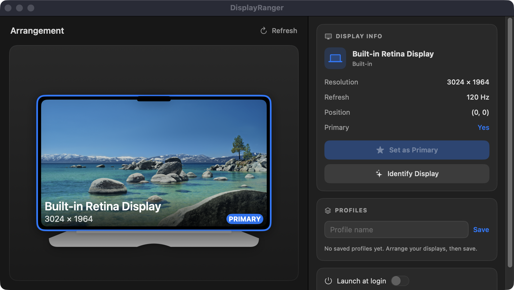
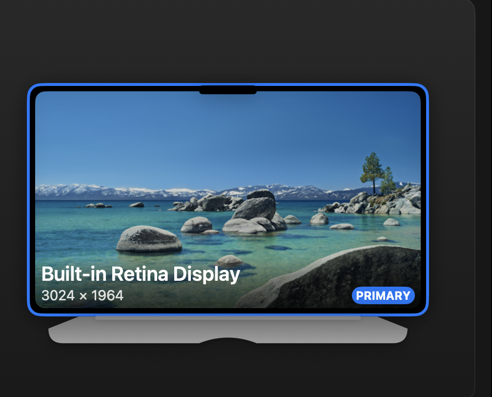
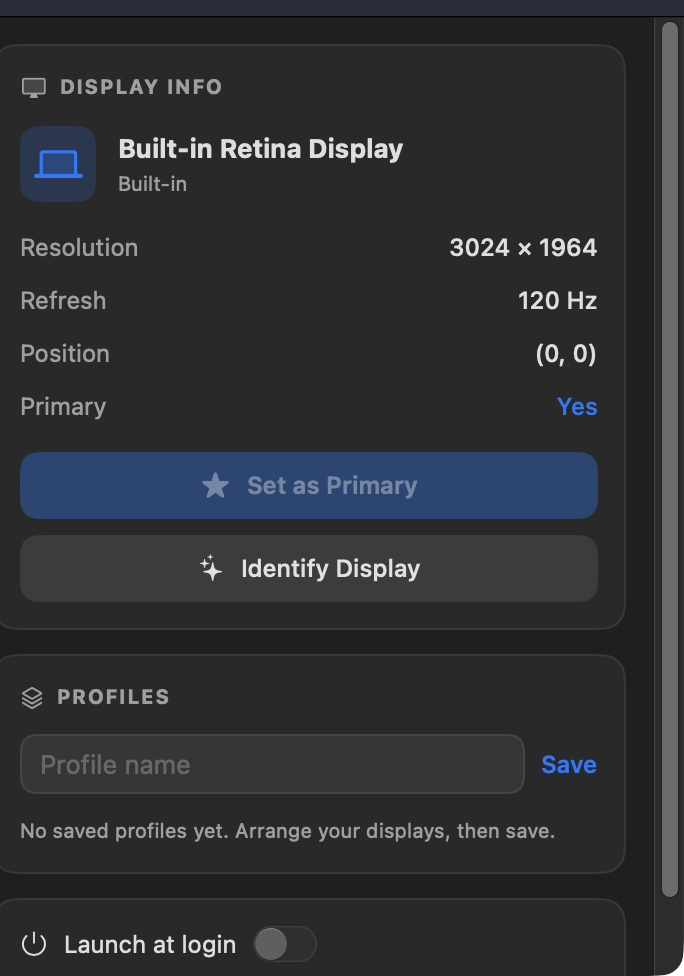

# DisplayRanger

**Arrange your Mac's displays visually — with real wallpapers, real device frames, and one‑click layout profiles.**

DisplayRanger is a focused macOS app that turns the fiddly System Settings → Displays
arrangement into a fast, good‑looking drag canvas. Each screen is drawn to scale inside
its actual device frame (a MacBook for the built‑in, an iMac for externals) showing its
*real* desktop wallpaper, so you always know which screen is which. Save a layout as a
named profile and restore it in a click — or have it restore itself the moment the right
displays connect.



<p align="center">
  
  
  
  
</p>

---

## Highlights

- 🖼️ **Real wallpapers, real device frames** — every display renders inside a MacBook or
  iMac body showing its own desktop picture. No more guessing which grey rectangle is which.
- 🖱️ **Drag to arrange** — move a tile, drop it, and the macOS arrangement updates instantly
  via `CGConfigureDisplayOrigin` (with the same edge‑snapping as System Settings).
- 📐 **Tiles never resize while you drag** — the canvas scale is locked to the *set* of
  displays, so repositioning only moves tiles; they rescale only when a display connects,
  disconnects, or you resize the window.
- 💾 **Layout profiles** — save an arrangement under a name; restore or delete it later.
  Profiles are keyed by each display's **stable CoreDisplay UUID**, so they survive
  reconnects and display‑ID reshuffles.
- ⚡ **Auto‑apply on connect** — flag a profile and it restores itself ~0.6 s after its
  displays appear (plug in at your desk → your layout returns).
- 🔦 **Identify Display** — flash a single physical screen to confirm which tile it is.
- ⭐ **Set as Primary**, live **connect/disconnect** updates, and **launch at login**.

## Screenshots

| Device frames + wallpaper | Sleek info & profiles sidebar |
| --- | --- |
|  |  |

## Build & run

Requirements: **macOS 14 (Sonoma)+**, a Swift toolchain (Xcode 15+ or
`xcode-select --install`).

```bash
git clone https://github.com/anup-a/DisplayRanger.git
cd DisplayRanger
swift run            # builds and launches the app
```

Release binary:

```bash
swift build -c release
.build/release/DisplayRanger
```

> **Must run non‑sandboxed.** Display reconfiguration uses the public
> `CGBeginDisplayConfiguration` / `CGConfigureDisplayOrigin` /
> `CGCompleteDisplayConfiguration` APIs — no entitlement required, but the process must
> not be App‑Sandboxed. Plain `swift run` from Terminal satisfies this. macOS may prompt
> the first time the app changes your arrangement; approve it.

## How it works

| Area | Approach |
| --- | --- |
| **Read layout** | `CGGetOnlineDisplayList` + `CGDisplayBounds`, names from `NSScreen.localizedName` |
| **Write layout** | one `CGBeginDisplayConfiguration` … `CGCompleteDisplayConfiguration` transaction |
| **Stay in sync** | `CGDisplayRegisterReconfigurationCallback` refreshes on connect/disconnect/rearrange |
| **Stable identity** | `CGDisplayCreateUUIDFromDisplayID` (ColorSync) → profiles survive ID reshuffles |
| **Wallpaper tiles** | per‑screen `NSWorkspace.desktopImageURL`, downsampled via ImageIO thumbnails |
| **Device chrome** | pure SwiftUI `Shape`s drawn *below* the screen so they never shift a tile's position |

Profiles persist to `~/Library/Application Support/DisplayRanger/profiles.json`.
**Restore is "apply‑what's‑present"**: displays in the profile that aren't connected are
skipped (and listed); the rest are positioned. If the profile's *primary* is the one
missing, the remaining displays are shifted so one still lands at origin (0,0) — which
macOS requires, or the restore is rejected.

## About iPad support — Sidecar vs Universal Control

DisplayRanger arranges **Sidecar** iPads: with Sidecar, the iPad becomes a *real extended
display* that shows up in `CGGetOnlineDisplayList`, renders as an iPad tile, and can be
saved in a profile.

**Universal Control iPads cannot be arranged by any app — by design.** Universal Control
runs iPadOS on the iPad and only shares the Mac's cursor/keyboard; to macOS the iPad is a
*linked device*, **not** a CoreGraphics display. It never appears in any display API, so no
third‑party app can position it. To use your iPad as an arrangeable screen, enable Sidecar:
**Control Center → Screen Mirroring → your iPad → "Use As Separate Display."**

## Status

Built and run on **macOS 15 / Swift 6.0.3 / Xcode 16.2 (Apple Silicon)** — builds clean,
launches, and renders against real hardware (built‑in Retina + external 4K). Verified live:
display enumeration, primary detection, real per‑display names, stable UUID keying, the
sleek UI, and live connect/disconnect updates. Steps that rearrange the physical desktop or
need an iPad (drag‑commit, Set‑as‑Primary, profile save/restore, Sidecar) are exercised
interactively.

## Roadmap / not yet

- **Launch at login** is wired via `SMAppService.mainApp`; it only functions inside a
  packaged `.app` (under `swift run` the toggle shows disabled with a hint).
- **App icon** is drawn programmatically at launch so the Dock tile appears even without a
  bundle; swap in an `Assets.xcassets` icon when packaging.
- No resolution / refresh / rotation / mirror changes yet, and no menu‑bar mode.
- When displays are stacked **vertically**, a tall device stand can dip toward the screen
  directly below it (side‑by‑side is gap‑safe).

## Project layout

```
DisplayRanger/
├── Package.swift
└── Sources/DisplayRanger/
    ├── DisplayRangerApp.swift        # @main SwiftUI app
    ├── Models/DisplayModel.swift
    ├── Managers/
    │   ├── DisplayManager.swift      # CGDisplay* read/write + reconfiguration callback
    │   ├── DisplayIdentity.swift     # stable UUID keying for profiles (ColorSync)
    │   ├── ProfileStore.swift        # Codable profiles + apply logic
    │   ├── AutoApplyEngine.swift     # connect-triggered restore
    │   ├── WallpaperStore.swift      # per-display wallpaper thumbnails
    │   ├── DisplayFlasher.swift      # "identify display" overlay flash
    │   ├── LoginItemManager.swift    # launch-at-login via SMAppService
    │   └── AppIcon.swift             # programmatic Dock icon
    └── Views/
        ├── ContentView.swift         # canvas + sidebar split
        ├── DisplayCanvasView.swift   # drag-to-arrange, locked scale, animated transitions
        ├── DisplayCardView.swift     # display tile (wallpaper + device frame)
        ├── DeviceChrome.swift        # MacBook / iMac frame shapes
        ├── InfoPanelView.swift       # selected display details + actions
        ├── ProfilesView.swift        # save / restore / delete / auto-apply
        ├── LoginItemToggle.swift     # launch-at-login toggle
        └── SidebarStyle.swift        # shared cards, buttons, rows
```

## License

MIT — see [LICENSE](LICENSE).
